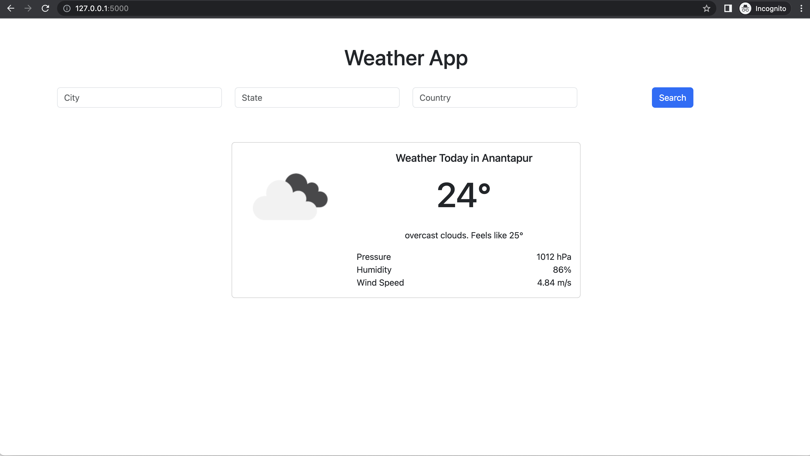

# weather-app-flask

Simple weather application built using flask that displays weather of a city.

## Pre-requisites
Install the required packages from **requirements.txt** file.

Create an account in the openweathermap.org for the API_KEY.

Add the API_KEY in the **.env** file.

Run the **app.py** file for the flask application to run.

## Demo

